# House Prices - Advanced Regression Techniques

## პროექტის მიმოხილვა

პროექტის მთავარი მიზანი არის, რომ მოცემული ინფორმაციით დავაპრედიქტოთ სახლის ფასები. მოცემულია 79 განსხვავებული მონაცემი (სვეტი) თითოეული სახლის ინფორმაციის აღსაღწერად. ამ ინფორმაციას გადავაქცევთ მოდელისთვის წაკითხვად მონაცემებათ, რომლითაც სხვადასხვა პარამეტრის ოპტიმიზაციით მას შეეძლება ფასის დადგენა (ახალი შემოსული დატასთვის).
ამისთვის საჭირო იქნება:
მონაცემთა გააზრება და გაფილტვრა, რათა მოერგოს მოდელში შემავალ მონაცემებს
featureბის დამუშავება (Feature Engineering), რათა ვნახოთ რომელი მათგანი არის გამოსადეგი და რომელი უბრალოდ noise.
შევარჩიოთ რაც შეიძლება გამოსადეგი featureბი
დავატრენინგოთ მოდელები სხვადასხვა ჰიპერპარამეტრებზე ჩვენს მიერ დამუშავებული/არჩეული futureბის მიხედვით
გავაკეთოთ მოდელების სწორი ანალიზი, რათა ავარჩიოთ საუკეთესო მათგანი.

---

## რეპოზიტორიის სტრუქტურა

```
├── data/
│   ├── train.csv                    # ტრენინგის data
│   ├── test.csv                     # ტესტის data 
│   ├── data_description.txt         # ცვლადების აღწერა (კეგლიდან გამოყვა დანარჩენ data)
│   └── sample_submission.csv        # submission-ის ფორმატის ნიმუში (ესეც კეგლიდან)
├── imgforrm/                        # README-ში გამოყენებული სურათები
├── model_experiment.ipynb           # ძირითადი სამუშაო გარემო — cleaning, feature engineering, feature selection, training, logging on mlflow
├── model_inference.ipynb            # ტესტზე prediction Model Registry-დან ჩამოწერილი საუკეთესო მოდელით
├── preprocessing_artifacts.pkl      # შენახული transformer-ები (inferenceსთვის)
├── submission.csv                   # Kaggleზე დასასაბმიტებელი ფაილი (გენერირდება inferenceის შემდეგ)
├── submission2.csv                  # იგივე ფაილია, რაღაცას ვამოწმებდი. 
└── README.md                        # პროექტის დოკუმენტაცია
```

---

## Feature Engineering

### კატეგორიული ცვლადების რიცხვითში გადაყვანა

 ვნახე, რომ 38 რიცხვითი, ხოლო 43 კატეგორიული ცვლადი ინახებოდა ტრეინ სეტში.
 პირველ რიგში, გადავწყვიტე მენახა na რომელ სვეტში იყო, და რას ნიშნავდა (იმას, რომ ინფორმაცია უბრალოდ დაკარგული/ამოკლებული იყო, თუ ნიშნავდა რომ სახლს არ გააჩნდა ის თვისება, რასაც შესაბამისი სვეტი აღწერდა)
 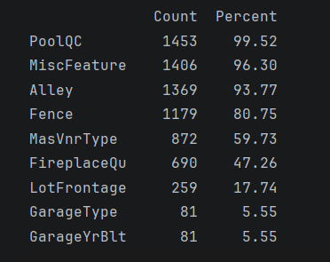
 როგორც მონაცემთა აღწერაში წერია, თუ na არის რომელიმე სვეტის მნიშვნელობაში, ეს ნიშნავს, რომ სახლს საერთოდ არ გააჩნია feature. ამიტომ შეგვიძლია შევცვალოთ ან 0 ით (თუ რიცხვითია) ან უბრალოდ noneით
 მაგრამ იყო 2 value რომელიც უბრალოდ გამოტოვებული იყო. LotFrontage და Electrical.
 LotFrontage ჩავნაცვლე სამეზობლოს მედიანით (სამეზობლოებს განსხვავებული lot sizeბი ჰქონდათ, უფრო ლოგიკური სამეზობლოს აღება იყო ვიდრე გლობალურის), ხოლო electrical მოდით (ყველაზე გამოყენებადი მნიშვნელობით)

 ამის შემდეგ, ვეცადე მენახა outlier მნიშვნელობები, რომლებიც არ შეესაბამებოდნენ სხვა სახლების ინფორმაციისა და ფასს შორის დამოკიდებულებას.
 იყო ორი ასეთი სტრიქონი, სადაც საცხოვრებელი ფართი 4000ზე მეტი იყო ხოლო ფასი 300000ზე ნაკლები, რაც ძალიან არარეალურია და ტრენინგისას მოდელს უბრალოდ აუთლაიერების სწავლასას მოთხოვდა.

შემდეგ უბრალოდ გავაკეთე ზემოაღწერილი ცვლილებები და ვნახე, სწორად შეიცვალა თუ არა ისინი.
შეგვეძლო უბრალოდ ყველა na შეგვევსო 0ებით ან მედიანებით (გააჩნდა შემთხვევას), თუმცა ამ შემთხვევაში დავკარგავდით დიდ ინფორმაციას, ან შემოვიტანდით ზედმეტ noiseს. სვეტების ინფორმაციის სწორი ანალიზით და სწორად შევსებით ჩვენს მოდელს უფრო მეტი ინფორმაცია ექნება სწორი predictionების გაკეთებისთვის.

შემდეგ დავადგინე, რომელ რიცხვით featureბს ჰქონდათ ყველაზე მეტი კორელაცია salespriceსთან (ყველაზე გამოსადეგი ცვლადები რომლები იყო.)
 overallqual ხარისხი ყველაზე მეტად მოქმედებს ფასზე
 სახლის ფართს აქვს დიდი მნიშვნელობა
 გარაჟის ქონა/ზომა
 რამდენად ახალია სახლი

 შევქმენი ახალი featureბი რომლებიც აერთიანებდნენ ყველაზე მოქმედ ცვალდებს მაგალითად ფართობს, სველ წერტილებს, ტერასას/ეზოს
  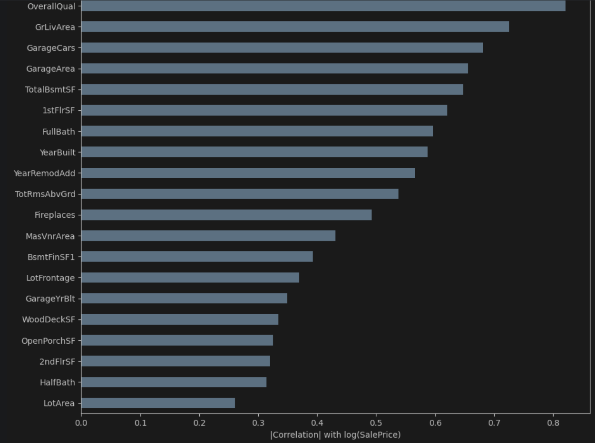
  შემოვიღეთ ბინარური ცვლადები (აქვს თუ არა აუზი, გარაჟი, გარემონტებულია და ა.შ)
  ასევე გვაქვს ცვლადები სახლის ასაკის/ბოლო რემონტიდან გასული დროისთვის (ახალი/ახალი გარემონტებული ფასს უფრო ზრდის)
   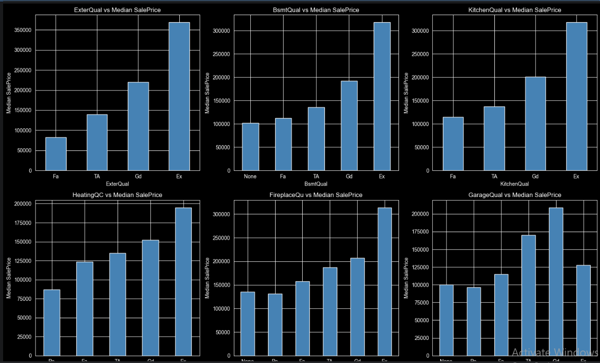
   შედარებულია ძველი და ახალი featureბის მოქმედება ფასზე 
  
  
  გამოვიყენე ordinal encoding ანუ ზოგიერთი feature შეგვიძლია განვსაზღვროთ მისი ხარისხით (ღობე, გარაჟის/სარდაფი რამდენად კარგია და ა.შ)
  აქვს კატეგორიები, რომლებიც პროპორციულად მოქმედებენ ფასზე (ohe ხარისხს ვერ შეაფასებდა ისე, როგორც ეს მეთოდი)
    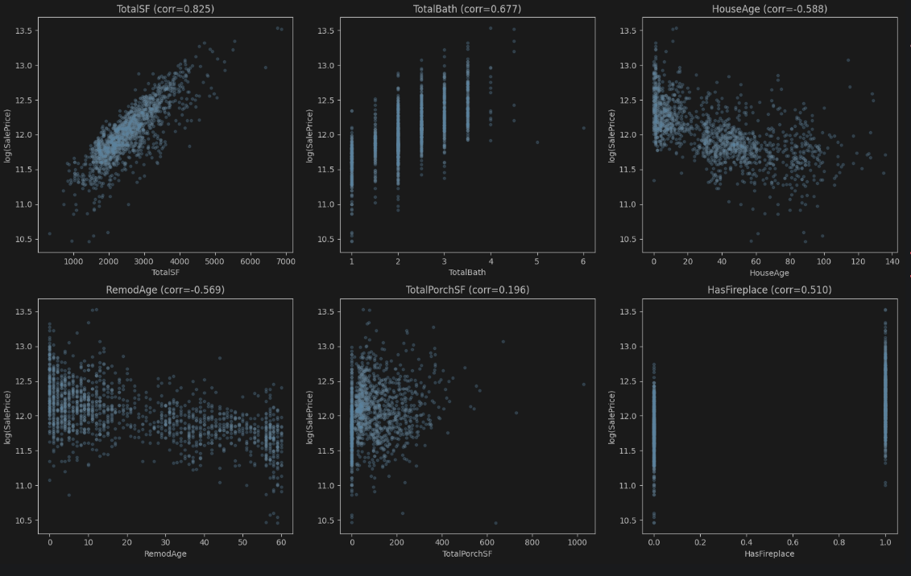

   one hot encoding ნომინალური ცვლადებისთვის, რომლებსაც ვერ შევაფასებთ ხარისხით (მაგ. სამეზობლო). ვიყენებთ
   drop=first: ამოიღებს ერთ-ერთ კატეგორიას (ერთმენათთან კოლერილებული ცვლადების ამოღება)
   handle_unknown=ignore: აიგნორებს ტესტ სეტში თუ არის ახალი კატეგორია
   

   გალოგარითმება ნორმალურ განაწილებაზე დასაყვანად: log1p. ავიღეთ ცვალდები, რომლებსაც skewness 0.75ზე მეტი ჰქონდათ და გალოგარითმებით დავიყვანეთ ნორმალურ განაწილებაზე (ლინეარ მოდელებისთვის უფრო მარტივი/მნიშვნელოვანია რომ განაწილება ნორმალური იყოს)
  
 
## Feature Selection

  კორელაციის ფილტრი: სხვადასხვა featureბიდან ამოვიღეთ ერთმანეთზე ძლიერად კოლერილებული ცვლადებიდან ერთ-ერთი. თუ კოლერაცია 0.85ზე მეტია ამოვიღებთ ერთ-ერთს. წინააღმდეგ შემთხვევაში ლინეარ მოდელის სტაბილურობას შეუშლის ხელს (noise).

  feature importance (random forest) აფასებს ინპუტის დატაპოინტების მნიშვნელოვნებას საბოლოო შედეგისთვის (gini, entrophy). თუ importance მეტია 0.001ზე ანუ ვალიდური ინფორმაციაა, თუ არა მაშინ უბრალოს ნოიზია. (მოქმედებს არაპიდაპირ კავშირებზეც ცვლადებს შორის). (რომელი ფიჩერები ამცირებს ვალიდაციას ყველაზე მეტად)
  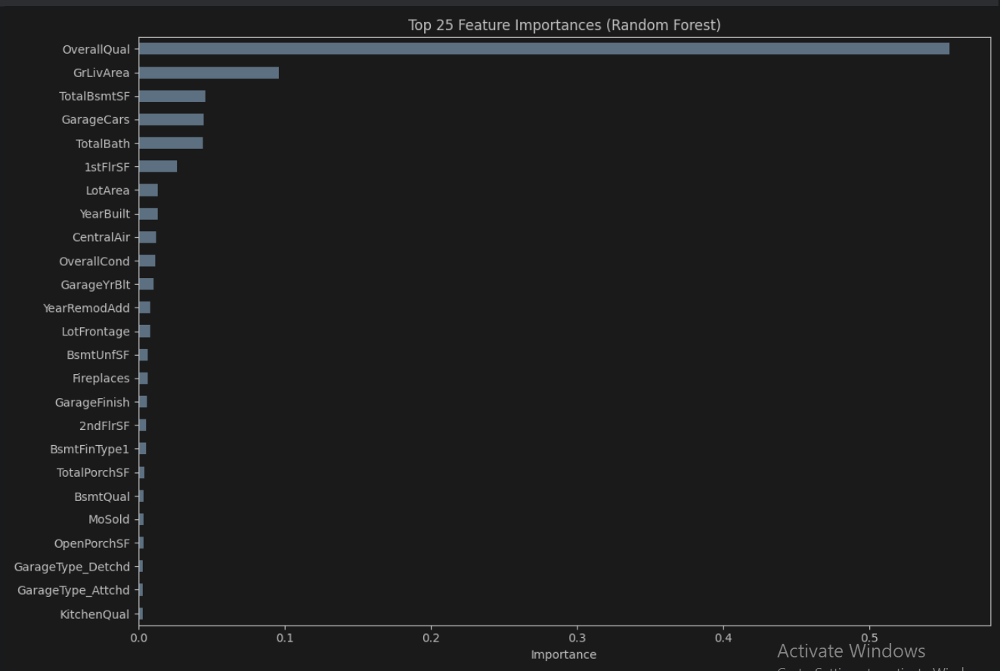

  recursive future elimination ის ბევრჯერ (რეკურსიულად) ფიტავს მოდელს სხვადასხვა ინპუტისთვის. შლის ნაკლებად მნიშვნელოვან ინპუტებს.

  Mutual Informatoin მუშაობს როგორც IV თუმცა, MI გვეუბნება იმას თუ რამდენად ბევრ ინფორმაციას იძლევა დასაპრედიქტებელ ცვლადზე მოცემული feature
  მოქმედებს არაწრფივ კავშირებზე
  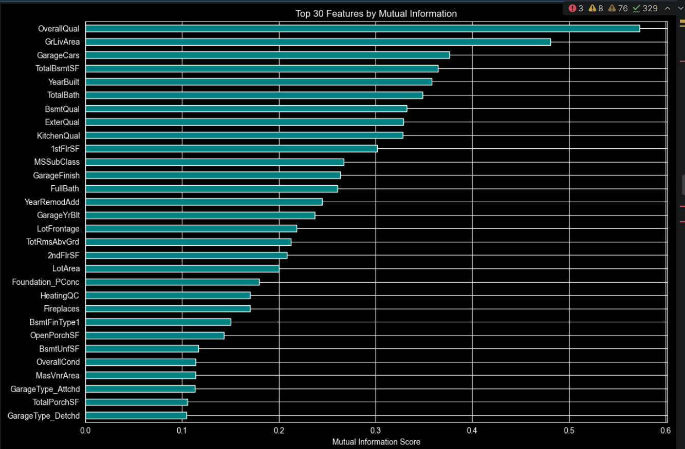
  
  Permutation Importacne რანდომად ცვლის შერჩეულ featureბის ველიუს მოდელისთვის. მოდელის პრედიქშენის ერორი თუ გაიზარდა ანუ შეცვლილი ცვლადი მნიშვნელოვანი იყო, თუ უმნიშვნელოა არ იცვლება შედეგი. ეს მიდგომა ზომას უშუალოდ გატესტვით ცვლადის გავლენას შედეგზე. კარგია კოლერილებული დატასთვის.
  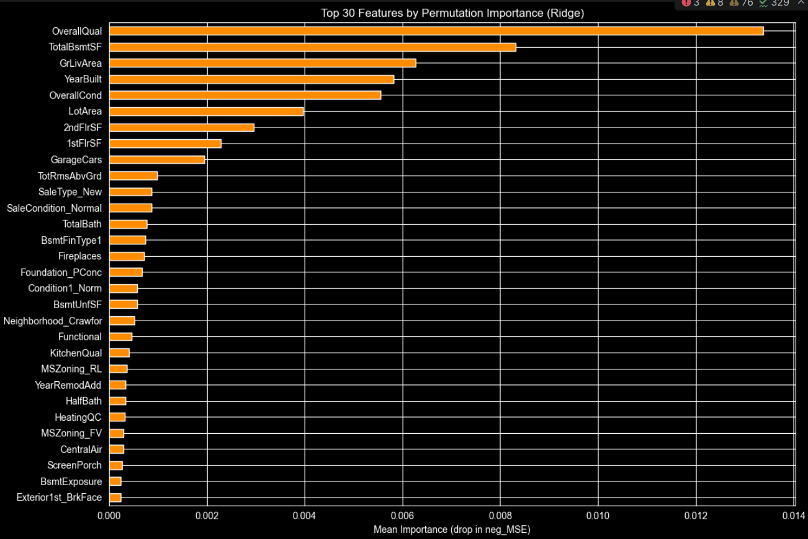

### მეთოდების შედარება
   ზემოთ განხილული ხუთივე მოდელი შედარებულია ridge alpha=10(ლინეარ რეგრეშენის ერთ-ერთი ოპტიმიზაციის) მოდელით, რომელსაც ვუშვებთ 5fold(k=5 დატა იყოფა 5 ნაწილად) ქროს ვალიდაციაზე, და ვაფასებთ rmseს (იგივე მეტრიკით ფასდება საბოლოო მოდელის პრედიქშენებიც). რაც უფრო ნაკლებია იგი, ანუ უფრო კარგი იქნება შედეგი უნახავ დატაზე.
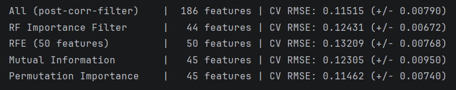
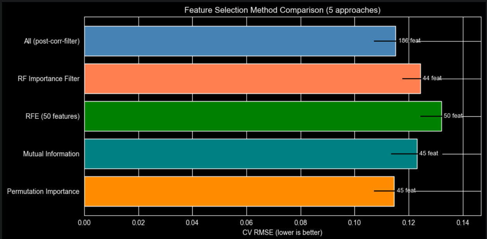
  ასევე ნაჩვენებია რამდენად სტაბილურია featureბის შერჩევის მეთოდი 5ივე ფოლდზე. (+-).
  საბოლოოდ ყველაზე მაკლები რმსე ქროს ვალიდაციაზე permutation importanceს აქვს. ასევე ვხედავთ, რომ ყველაზე ცოტა featureს იყენებს. ბევრი feature უბრალოდ ზემეტ ნოისს შემოიტანს მოდელისთვის, რაც არ არის კარგი.

---

## Training

  Linear regression
  უბრალოდ არჩევს weightებს რომლებიც ერორს შემაცირებენ. არის გამოყენებულთაგან ყველაზე მარტივი მოდელი.
  დააბრუნა შედეგები:
  Train rmse 0.10653 train dataზე დაფიტვა
  val rmse  0.11425 რამდენად კარგად აპრედიქტებს ახალ დატას
  cv rmse  0.11300  საშუალო 5 ფოლდზე.
  val r2 0.9226  ფასის ვარიაციის 92.3%ს ხსნის
  overfit 1.072  val/train ratio 
  baseline მოდელისთვის ნორმალურია, val/train შეფარდებაც მისაღებია. თუმცა რეგულარიზაციის უკეთეს შედეგს მივიღებთ.

  linear რეგრესია (L2 რეგულარიზაციით) Ridge regression 
  Loss = MSE + ალფა * ჯამი(წონები^2)
  შეგვიძლია ალფას დარეგულირება. პირველი ავარჩიე მინიმალური 0.1, რათა ვნახო ბეისლაინის შედეგს რამდენად გააუმჯობესებს.
  train rmse 0.10653
  val rmse 0.11425
  cv rmse 0.11300
  val r2 0.9226
  overfit 1.072
  კარგად აკეთებს გენერლიზაციას, შეფარდება 1თან ახლოსაა, ნორმალური ვალიდაციის rmse
  შევცვალე ჰიპერპარამეტრის მნიშვნელობა 
  1, 10, 50, 100. მოკლედ შევაფასებ მათ დაბრუნებული შედეგების მიხედვით
  თუ დიდ ალფა კოეფიციენტზე ვალიდაციის rmse გაიზრდება, ნიშნავს რომ ზედმეტ რეგულარიზაციას ვუკეთებთ და მოდელი underfitted ხდება
  1- იგივე რაც 0,1ზე
  10 - წონებს ნულისკენ წევს, კარგია დიდად კოლერილებული დატასთვის. შედეგი თითქმის იგივე.
  50 - თითქმის იგივე რაც 100ზე ხდება.
  100 - კოეფიციენტები ხდება ძალიან მცირე. prediction უახლოვდება საშუალოს. ასეთი დიდი ალფა ნიშნავს ბაიასს, მოდელი ვერ სწავლობს ვერაფერს

  ყველა ridge regressionის ჰიპერპარამეტრებს შორის საუკეთესო მოდელი:
  ალფა როცა 1ის ტოლი იყო ვალიდაციის rmse იყო 0.11424. როცა იგი იზრდება, ტრეინის რმსე ადის მაღლა და მიდის ანდერფიტში. ოდნავ გაზრდისას ვალიდაციის rmse მცირდება შემდეგ კი იზრდება. 1.0 კი კარგი ბალანსია ბაიასსა და ვარიაციას შორის.
  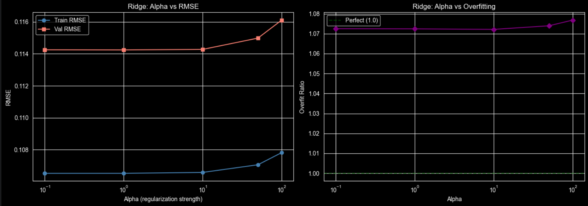

  Lasso regression L1ის რეგულარიზაცია. ზოგ კოეფიციენტს ხდის 0ს (აკეთებს feature სელექშენს). რაც უფრო დიდს შევარჩევთ ამ ჰიპერპარამეტრს, მით მეტი feature წაიშლება.
  
  alpha = 0.0001 ძალიან მცირე სელექშენი, ტოვებს თითქმის ყველა featureს.
  Train RMSE: 0.10653 
  Val RMSE:   0.11426 
  CV RMSE:    0.11289 
  Val R²:     0.9225  
  Overfit:    1.073  

  alpha = 0.001 შლის ოდნავ მეტ featureს შედეგი თითქმის იგივე.

  0.01 კარგია თუ ბევრი ცვლადი ნოისია. 

  0.1 რჩება მხოლოდ ყველაზე მნიშვნელოვანი featureბი. დიდი რისკია ანდერფიტის თუ სასარგებლო featureბსაც მოაშორებს.

  lasso regression მოდელების შედარება:
    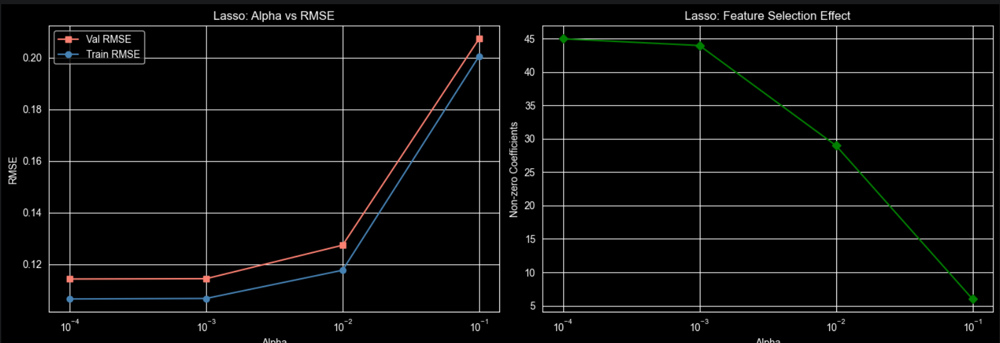
    alpha = 0.0001 val rmse = 0.11426 45 featureით

  ridge და lasso რეგულარიზაციების გაერთიანება elasticnet

  შერჩეულ ჰიპერპარამეტრებს ვაგდებთ გრიდში
  enet_grid = [
  (0.0005, 0.2), (0.0005, 0.5), (0.0005, 0.8),
  (0.001, 0.2), (0.001, 0.5), (0.001, 0.8),
  (0.005, 0.2), (0.005, 0.5), (0.005, 0.8),
  (0.01, 0.3), (0.01, 0.7),
]
  შემდეგ კი გადაუყვება და ყველა ჰიპერპარამეტრით უშვებს მოდელს.
  მოდელის უპირატესობაა, რომ არამნიშვნელოვან featureბს პირდაპირ აგდებს და ასევე ფილტრავს ერთმანეთზე კოლერილებულებსაც.
  შედეგი:alpha=0.0005, l1=0.5 | val RMSE: 0.11428 | overfit: 1.073
  alpha=0.0005, l1=0.8 | val RMSE: 0.11428 | overfit: 1.072
  alpha=0.0010, l1=0.2 | val RMSE: 0.11427 | overfit: 1.073
  alpha=0.0010, l1=0.5 | val RMSE: 0.11429 | overfit: 1.072
  alpha=0.0010, l1=0.8 | val RMSE: 0.11433 | overfit: 1.072
  alpha=0.0050, l1=0.2 | val RMSE: 0.11449 | overfit: 1.072
  alpha=0.0050, l1=0.5 | val RMSE: 0.11515 | overfit: 1.070
  alpha=0.0050, l1=0.8 | val RMSE: 0.11644 | overfit: 1.067
  alpha=0.0100, l1=0.3 | val RMSE: 0.11570 | overfit: 1.070
  alpha=0.0100, l1=0.7 | val RMSE: 0.12165 | overfit: 1.074
 საუკეთესო->
alpha=0.0005, l1_ratio=0.2
   Val RMSE = 0.11426

   Decision Tree:
   depth = 3 არის ანდერფიტი. დიდი ბაიასი აქვს რადგან მხოლოდ 3 გაყოფით ვერ სწავლობს შემოსული დატას კომპლექსურობას.
   depth = 5 იზრდება ოვერფიტ რატიო. (რმსების შეფარდება)
   depth = 10 საგრძნობლად იზრდება overfit ratio. ასრულებს ზედმეტად ბევრ გაყოფას ამიტომ დიდია შეფარდება ტრეინისა და ვალიდაციის.
   depth = 15. ზედმეტად ბევრი გაყოფა. იმახსოვრებს ზედმეტად ბევრ ტრეინ დატას. არის ძალიან overfitted.
   depth = none. თუ არ შევზღუდავთ სიღრმეს, ისწავლის ყველაფერს, ტრეინ სეტზე ექნება თითქმის ნული rmse, თუმცა ვალიდაციაზე ზედმეტად დიდი იქნება. ექნება ძალიან დიდი ვარიაცია.

   depth = 10 min saple split = 10. მინიმუმ 10 დატაპოინტი უნდა ჰქონდეს ნოუდს რომ გაიყოს. ამცირებს ნოუდებში ძალიან მცირე რაოდენობის მქონდა გაყოფებს. რაც უფრო დიდია იგი მით უფრო მცირდება ოვერფიტი. (თუმცა ამ კონკრეტულ მოდელს მაინც ჰქონდა ოვერფიტი.)
   depth=10, min_samples_leaf=5 leafში უნდა იყოს მინიმუმ 5 დატაპოინტი. ამცირებს ოვერფიტს. მაინც არის ოვერფიტ, ოღონდ იმაზე მცირედ ვიდრე წინა მოდელები. 
   depth=10, max_features=sqrt გაყოფისას განიხილავს მაქსიმუმ მთლიანი რაოდენობის ფესვ featureს. ანუ გაყოფისას უფრო რანდომული იქნება. მაინც არის ოვერფიტი. 
       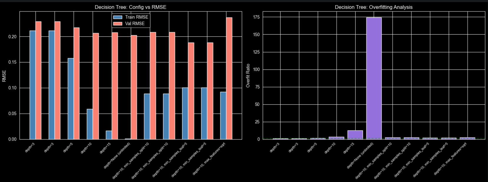
       max depth ყველაზემეტად მოქმედებდა შედეგზე და აკონტროლებდა ხის complexityს.
       min sapmples split და min samples leaf ამცირდება ოვერფიტს, არ გაიყოფოდა მცირე დატაზე.
       max feature ამცირებდა ვარიაციას, რადგან გაყოფებში რანდომულობა ემატებოდა.
       საუკეთესო მოდელი:
       depth=10, min_samples_leaf=5 (Val RMSE = 0.18797)

  random forest:
   100 ხე, მაქსიმუმ სიღრმე 10. უკეთესია ვიდრე ერთი ხე. არის ოდნავ ოვერფიტი. 
   n=200, depth=15, ასეთ დიდ მოდელს შეუძლია უფრო დიდი კომპლექსურობის გამოხატვა. ისევ არის ოვერფიტედ.
   n=300, depth=None
   უკვე ვნახეთ, რომ ხეს რომელსაც ულიმიტო სიღრმე აქვს, არის ძალიან ოვერფიტედ. თუმცა, რენდომ ფორესტი ასაშუალოებს და ამცირებს ვარიაციას. 

   n=200, depth=15, min_leaf=5
   უკეთესი გენერალიზაცია აქვს ვიდრე ნორმალურს. არის წინა მოდელებზე უკეთესი.

   n=200, depth=15, max_feat=sqrt
   ამატეს რენდომნესს, ამცირებს ოვერფიტს. 

   n=200, depth=15, max_feat=0.5
   თითო სპლიტი ითვალისწინებს მხოლოდ ნახევარ featureბს. დააბრუნა თითქმის იგივე შედეგი, რაც წინამ.
   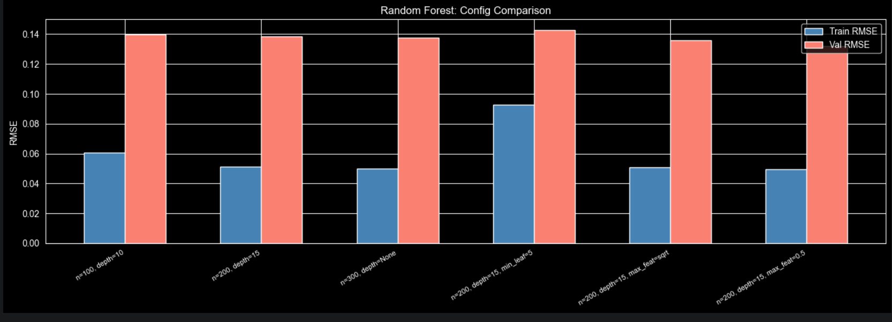
   n=200, depth=15, max_feat=0.5 (Val RMSE = 0.13212)
   ეს კონკრეტული ჰიპერპარამეტრები უფრო ამცირებდნენ ოვერფიტს, ვიდრე სხვები. 

   საბოლოო მოდელის შერჩევა:
   sorted by validation rmse
                            name  train_rmse  val_rmse  cv_rmse   val_r2  overfit_ratio
                 Ridge_alpha=1.0    0.106528  0.114243 0.112971 0.922578       1.072417
                 Ridge_alpha=1.0    0.106528  0.114243 0.112971 0.922578       1.072417
                 Ridge_alpha=1.0    0.106528  0.114243 0.112971 0.922578       1.072417
                 Ridge_alpha=1.0    0.106528  0.114243 0.112971 0.922578       1.072417
                LinearRegression    0.106528  0.114250 0.113003 0.922568       1.072497
                LinearRegression    0.106528  0.114250 0.113003 0.922568       1.072497
      ElasticNet_a=0.0005_l1=0.2    0.106530  0.114260 0.112880 0.922555       1.072562
      ElasticNet_a=0.0005_l1=0.2    0.106530  0.114260 0.112880 0.922555       1.072562
      ElasticNet_a=0.0005_l1=0.2    0.106530  0.114260 0.112880 0.922555       1.072562
              Lasso_alpha=0.0001    0.106530  0.114265 0.112886 0.922549       1.072604
RF_n=200, depth=15, max_feat=0.5    0.049433  0.132124 0.130805 0.896446       2.672783
პირველს ჰქონდა ყველაზე მცირე ვალიდაციის rmse
   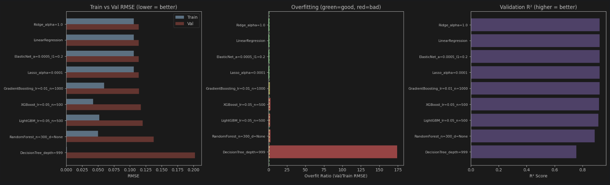
   გრაფებზე ნაჩვენებია 1. ტრეინისა და ვალიდაციის rmse დაბალი უკეთესია 2. overfitის ratio დაბალი უკეთესია 3. r2 score მაღალი უკეთესია
   ამ მონაცემებზე დაყრდნობით, საუკეთესო მოდელია linear regressionის ridge ოპტიმიზაცია სადაც ალფა 1ის ტოლია. ridge alpha = 1.0
   მას აქვს ყველაზე ცოტა val rmse, ანუ საუკეთესო პრედიქცია უნახავ დატზე, ქროს ვალიდაციის რმსე ახლოსაა ვალიდაციის რმსესთან ანუ სტაბილური მოდელია. აქვს კარგი bias/variance ბალანსი. 
     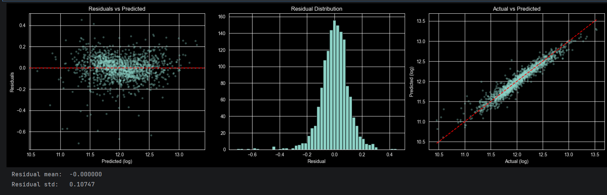
     residual = yactual - ypredictd. ჩვენ ყველაზე მეტად გვაწყობს ეს ცვლადები განაწილებული იყოს 0თან ახლოს. ასევე არ უნდა ქმნიდეს რაიმე პატერნს რადგან ამ შემთხვევაში მოდელის ერორები არ იყო რენდომული და იყო ბაიასი. რაიმე პატერნის შექმნის შემთხვევაში (გააჩნია პატერნს), ნიშნავს, რომ მოედლი ზოგიერთ ფასის რეინჯზე უშვებს მხოლოდ შეცდომებს. (შეიძლება იყოს წაშლილი featureბი ან აუთლაიერები)

   ოვერფიტედ მოდელები:
   overfitted models 
  RF_n=200, depth=15, max_feat=0.5:
    Train RMSE = 0.04943, Val RMSE = 0.13212
    Overfit ratio = 2.67
  RF_n=200, depth=15, max_feat=0.5:
    Train RMSE = 0.04943, Val RMSE = 0.13212
    Overfit ratio = 2.67
  RF_n=200, depth=15, max_feat=0.5:
    Train RMSE = 0.04943, Val RMSE = 0.13212
    Overfit ratio = 2.67
    ეს მოდელები ზედმეტად კომპლექსური იყო დატასთვის. ისინი იმახსოვრებენ ტრეინინგ დატას თავისი ნოიზით, თუმცა ახალ ინფორმაციაზე უსარგებლოა. 
    არ გვქონია მოდელები, რომლებიც ზედმეტად ანდერფიტედ იყო. ეს მოდელები იქნებოდნენ ისინი, რომლებიც ზედმეტად მარტივები არიან და ვერ სწავლობენ კომპლექსურ პატერნს. 
    ყველა მოედლისთვის დაგენერირებული არის train rmse, val rmse, 5fold cv rmse, overfit ratio. ასევე გენერირებულია გრაფიკები ყველასთვის. 
    Ridge/Lasso: Alpha vs RMSE (train/val) — ნაჩვენებია bias-variance
   Lasso: Alpha vs Nonzero Coefficients — ნაჩვენებია feature selection
   Decision Tree: Depth vs RMSE
   
    
    
  overfitted მოდელები- decesion tree ულიმიტო სიღრმით. train rmse იყო თითქმის 0, იმახსოვრება ყველა დატას. val rmse იყო მაღალი, ვერ აკეთებდა გენერალიზაციას (უცნობ მონაცემებზე ვერ მუშაობდა). 
  
  underfitted მოდელი - decision tree 2 სიღრმით. Train RMSE და Val RMSE ორივე მაღალია, r2 <0.75. არის ძალიან მარტივი და ვერ აღიქვამს შემოსულ მონაცემთა სირთულეს. 

---

## MLflow Tracking

  https://dagshub.com/rkvit23/ML-HW1.mlflow/#/experiments
  https://dagshub.com/rkvit23/ML-HW1.mlflow

### ჩაწერილი მეტრიკების აღწერა

| მეტრიკა | აღწერა | რისთვის გვჭირდება |
|---------|--------|-------------------|
| `train_RMSE` | RMSE ტრენინგ სეტზე (log scale) | რამდენად კარგად სწავლობს მოდელი ტრენინგ მონაცემებს |
| `val_RMSE` | RMSE ვალიდაციის სეტზე (log scale) | რამდენად კარგად აპრედიქტებს ახალ მონაცემებზე |
| `cv_RMSE` | 5fold cv RMSE | ბევრად არის გასპლიტული - სტაბილურია თუ არა  |
| `train_R2` | R² ტრენინგ სეტზე | ვარიაციის შეფარდება დამოკიდებული ცვალიდსთვის  |
| `val_R2` | R² ვალიდაციის სეტზე | იგივე რაც წინა უნახავი მონაცემებისთვის |
| `train_MAE` | MAE ტრენინგ სეტზე | (log scale) |
| `val_MAE` | MAE ვალიდაციის სეტზე |  |
| `overfit_ratio` | Val_RMSE / Train_RMSE | გვაჩვენებს მოდელის overfit/underfitს  |


| პარამეტრი | აღწერა |
|-----------|--------|
| `model_type` | მოდელის სახელი  |
| `feature_selection` | გამოყენებული Feature Selection მეთოდი |
| `n_features` | feature რაოდენობა |
| `alpha` | რეგულარიზაციის კოეფიციენტი |
| `learning_rate` | ბუსტინგ მოდელებისთვის |
| `n_estimators` | ხეების რაოდენობა (რენდომ ფორესტი) |
| `max_depth` | ხის მაქსიმალური სიღრმე |
| `reg_alpha`, `reg_lambda` | L1/L2 რეგულარიზაცია |
| `num_leaves` | ფოთლების რაოდენობა |

### საუკეთესო მოდელის შედეგები

 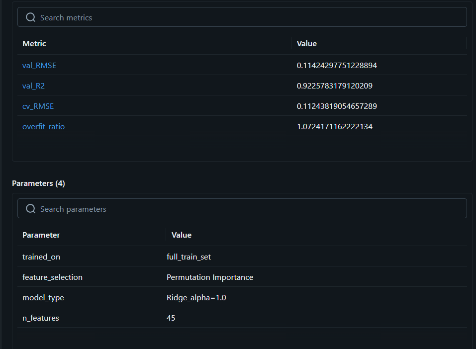
  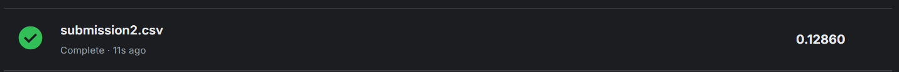


---

